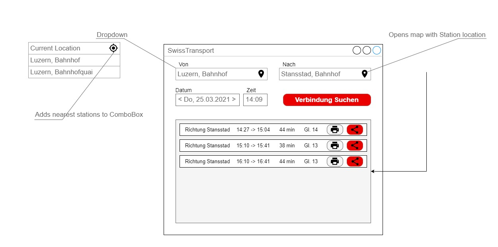
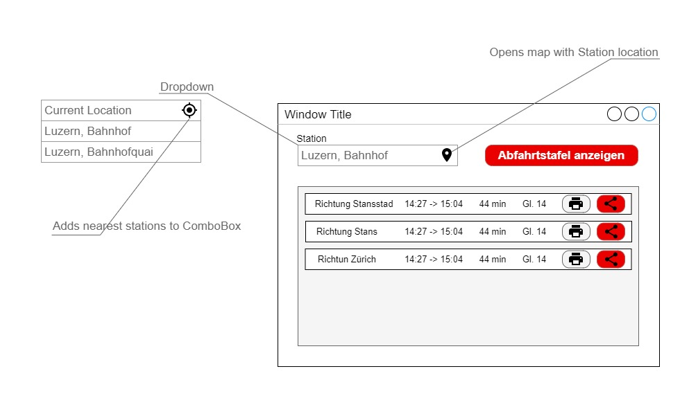

# Wireframes

### Connection Search

Fenster, in welchem der User die Start- und Endstation auswählen kann, um die geeigneten Zugs-Verbindung anzeigen zu lassen.

### Station Time board Search

Fenster, in welchem der User alle Verbindungen einer Station anzeigenlassen zum Beispiel wie die Anzeigetafel bei am Bahnhof Luzern über dem KKiosk. 

